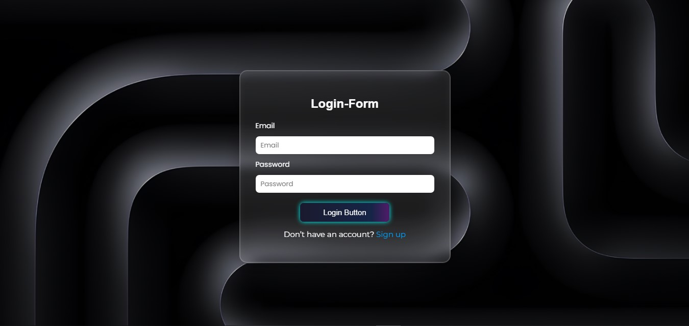

# Glass Login Card

A modern and responsive **Login Form** designed with **Glassmorphism UI**.  
Built using **HTML & CSS** only — featuring blur effects, gradient animations, and a fully responsive layout.

---

## ✨ Key Features
- **Glassmorphism UI** → subtle transparency & blur for a modern look  
- **Animated Gradient Button** → smooth hover and gradient transitions  
- **Responsive Layout** → adapts across desktop, tablet, and mobile devices  
- **Clean & Minimal Code** → easy to customize and integrate

---

## 📸 Preview
  
*(Here is the ss of login-form)*

---

## 🛠️ Technologies Used
- HTML5  
- CSS3 (Flexbox + Media Queries)  

---

## 📂 How to Use
1. Clone this repository:  
   ```bash
   git clone https://github.com/YasirAwaan/modern-login-ui.git
